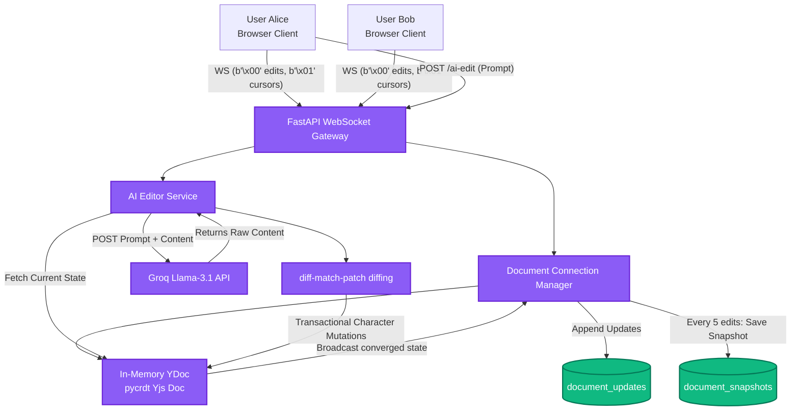

# Real-Time Collaborative Engine & AI Co-Editor

[](LICENSE)
[](https://www.python.org/downloads/)

A high-performance real-time collaborative document backend where multiple users (and an autonomous AI agent) edit the same document concurrently, utilizing Conflict-Free Replicated Data Types (CRDTs) to guarantee eventual consistency.


---

## The Tech Stack
* **Web Gateway & Router:** FastAPI (Python)
* **Real-time Pipeline:** Async WebSockets
* **Conflict Resolution (CRDT):** `pycrdt` (Python bindings for the Rust-backed Yjs implementation)
* **AI Core:** Groq API (running `llama-3.1-8b-instant`)
* **String Diffing Engine:** Google `diff-match-patch`
* **ORM & Database:** SQLAlchemy with SQLite (Strategy C Hybrid Storage)

---

## Architecture Design



---

## Why This Is Hard (Engineering Challenges)

1. **AI as a First-Class Citizen:** Most collaborative tools run AI in a separate sidebar and overwrite user states upon completion. This destroys concurrent user cursors and active selections. We resolved this by calculating minimal character insertions/deletions via `diff-match-patch` and executing them inside a single `pycrdt` transaction, keeping users' cursors intact.
2. **Byte-Framing on a Single Port:** To avoid socket overhead, we built a custom protocol layer. Prepended tags (`0x00` for CRDT edits, `0x01` for presence) isolate state updates from ephemeral cursor movements, preventing database write pollution.
3. **Database Write Amplification vs. Load Latency:** A pure transaction log grows too long, slowing down server load times. A pure snapshot store wastes network bytes. We solved this with a **Strategy C Hybrid Pattern** where we append micro-updates to `document_updates` and save composite YDoc binary snapshots in `document_snapshots` every 5 edits. The document is reconstructed by loading the latest snapshot and replaying only subsequent logs.
4. **Windows Loopback DNS Latency Quirk:** During testing on Windows, resolving `localhost` triggered IPv6 loopback lookups that timed out for exactly 2 seconds. By pinning the network connection strings to `127.0.0.1`, we dropped latency from **2100ms** to **5ms**.

---

## Performance Metrics (Local Benchmarks)

> [!NOTE]
> Measured on localhost with 2 simulated concurrent WebSocket clients and 1 concurrent AI client (see `tests/test_client.py` and `tests/test_persistence.py`). Not representative of cross-network latency.

* **Local state propagation:** **< 5ms** (Client-to-Client websocket relay).
* **Document Reconstruction Speed:** **< 3ms** (Loading latest snapshot + replaying post-snapshot operations).
* **AI Edit Convergence Time:** **~300ms** (Diff calculation + transactional YDoc application after receiving Groq completion).
* **Conflict Convergence Success:** **100%** under concurrent simulated edits (validated in `test_client.py`).

---

## Architectural Decision Records (ADRs)
For detailed explanations of our technical choices and the trade-offs involved, see the ADRs document:
👉 **[Read the Architectural Decision Records (docs/decisions.md)](docs/decisions.md)**

---

## How to Run Locally

### 1. Setup Environment
Clone the repository and create a Python virtual environment:
```bash
python -m venv venv

# Activate the virtual environment
source venv/bin/activate   # macOS/Linux
venv\Scripts\activate      # Windows

pip install -r requirements.txt
```

### 2. Configure Environment Keys (Optional)
To test live AI editing, create a `.env` file in the root directory:
```env
GROQ_API_KEY=your_actual_groq_api_key
```
> [!TIP]
> You can acquire a free API key at [groq.com](https://groq.com/). If run without a key, the core application (real-time CRDT sync, presence tracking, debugger conflict simulator, and operation logs) works fully out-of-the-box, with the AI Co-Editor falling back to a deterministic Mock editor.

### 3. Start the Collaborative Server
```bash
python -m uvicorn app.main:app --reload --port 8000
```

### 4. Open the Demo Dashboard
Double-click `demo/index.html` to open it in a browser, or serve it locally. This single-page test harness emulates two users (Alice and Bob) side-by-side using vanilla WebSockets and Yjs. You can type in either editor and click "Trigger AI Edit" to watch the real-time CRDT convergence.

### 5. Run Automated Tests
* **CRDT Convergence Test:** `python tests/test_client.py`
* **Smart Diff Unit Test:** `python tests/test_diff.py`
* **AI Integration Test:** `python tests/test_ai_editor.py`
* **Strategy C Persistence Test:** `python tests/test_persistence.py`
